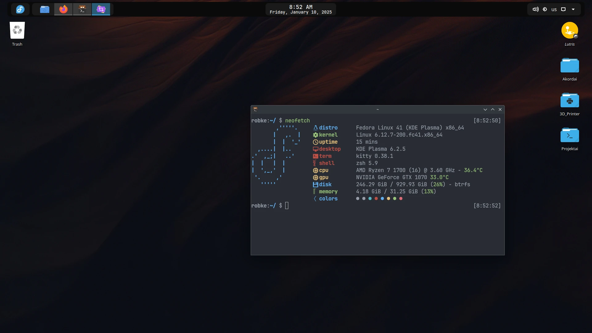

# My Daily dotfiles for Fedora 41 Linux with KDE (Wayland)

 


## Screenshots

;

## Features

- **Shell:** Zsh with [Oh My Zsh](https://ohmyz.sh/)
- **Terminal:** [Kitty](https://github.com/kovidgoyal/kitty)
- **Editor:** [VSCodium](https://vscodium.com/)
- **Theme:** 
    - [Icons - Tela Dark](https://store.kde.org/p/1279924)
    - [Panel - Panel Colorizer](https://store.kde.org/p/2130967)
    - [Music on Panel - Plasmusic-toolbar](https://store.kde.org/p/2128143)
    - [Wallpaper](https://images.hdqwalls.com/wallpapers/flying-birds-minimal-4k-f4.jpg)

## Configs

- **Oh My Zsh:** 
    - **[.zshrc file](./.zshrc)**
    - To work you need these plugins:
        - [zsh-autosuggestions](https://github.com/zsh-users/zsh-autosuggestions/blob/master/INSTALL.md)
        ```bash
        git clone https://github.com/zsh-users/zsh-autosuggestions ${ZSH_CUSTOM:-~/.oh-my-zsh/custom}/plugins/zsh-autosuggestions
        ```
        - [zsh-syntax-highlighting](https://github.com/zsh-users/zsh-syntax-highlighting/blob/master/INSTALL.md)
        ```bash
        git clone https://github.com/zsh-users/zsh-syntax-highlighting.git ${ZSH_CUSTOM:-~/.oh-my-zsh/custom}/plugins/zsh-syntax-highlighting
        ```
        - [zsh-autocomplete](https://gist.github.com/n1snt/454b879b8f0b7995740ae04c5fb5b7df#install-plugins)
        ```bash
        git clone --depth 1 -- https://github.com/marlonrichert/zsh-autocomplete.git $ZSH_CUSTOM/plugins/zsh-autocomplete
        ```
        - [NVM - Node Version Manager](https://github.com/nvm-sh/nvm?tab=readme-ov-file#installing-and-updating) (optional)
        ```bash
        curl -o- https://raw.githubusercontent.com/nvm-sh/nvm/v0.40.1/install.sh | bash
        ```
        - [Bun ](https://bun.sh/) (optional)
        ```bash
        curl -fsSL https://bun.sh/install | bash
        ```

- **VSCodium:**
    - [settings.json](./codium/settings.json)
    - [extensions.md](./codium/extensions.md)
    
- **Kitty:**
    - [kitty.conf](./kitty/kitty.conf)
    - **[JetBrains Font Required!](https://download-cdn.jetbrains.com/fonts/JetBrainsMono-2.304.zip)**

- **Fastfetch:**
    - [config.jsonc](./fastfetch/config.jsonc)
    ```bash
    mkdir -p ~/.config/fastfetch
    curl -o ~/.config/fastfetch/config.jsonc https://raw.githubusercontent.com/robke96/linux_dots/refs/heads/main/fastfetch/config.jsonc
    ```

- **KDE:**
    - [Keyboard shortcuts](./kde/shortcuts/kksrc)
    - [Plasma-Panel-Colorizer preset](./kde/panel-colorizer/howto.md)
    - [PlasMusic Toolbar settings](https://i.postimg.cc/L2KZwPJG/Screenshot-20241220-091348.png)

## Scripts

- **[NVIDIA GPU FAN Control](https://github.com/wotikama/nvidiafan)** 
    - Move script to safe place for example:
        ```bash
        mkdir -p ~/.config/scripts
        curl -o ~/.config/scripts/nvidiafan.sh https://raw.githubusercontent.com/robke96/linux_dots/refs/heads/main/scripts/nvidiafan.sh
        ```

    - Give permissions for script
        ```bash
        chmod +x ./nvidiafan.sh
        ```
    - Configure sudo for paswordless execution
        - Edit the sudoers file using visudo:
        ```bash
       sudo visudo
       ```

        - Add this line at the end of the file, replace `<YOUR USERNAME>` with your username
        ```bash
        <YOUR USERNAME> ALL=(ALL) NOPASSWD: /usr/bin/nvidia-settings *
        ```

    - Add script on startup launch and you good to go. KDE Autostart
